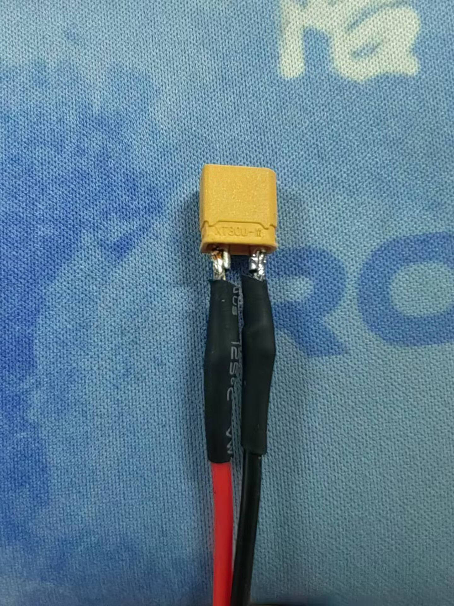
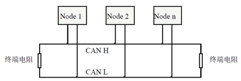
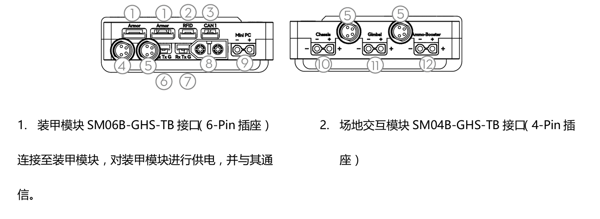
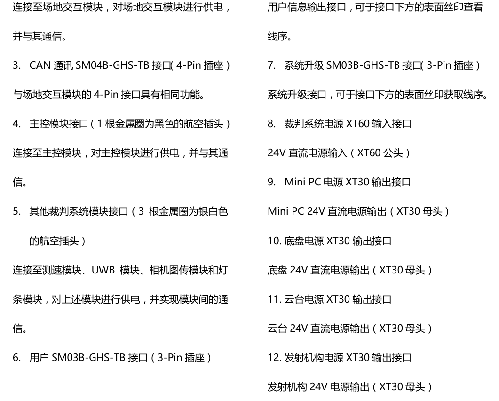
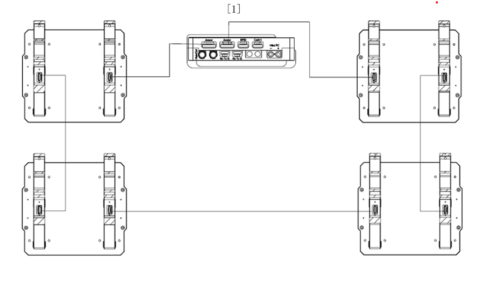
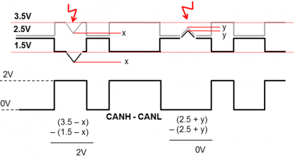
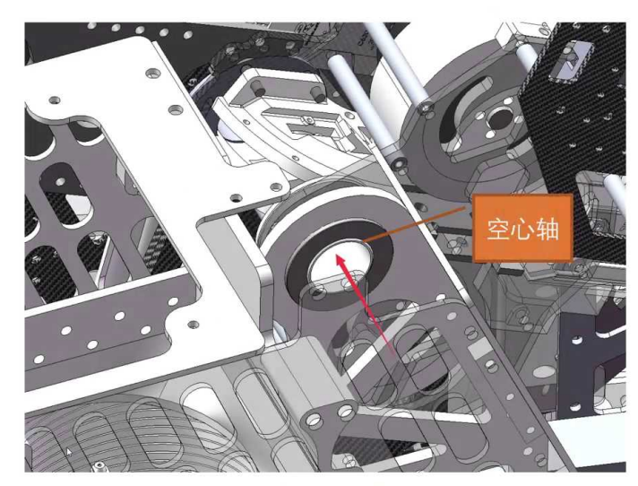
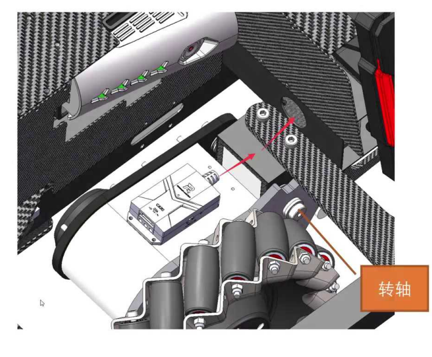
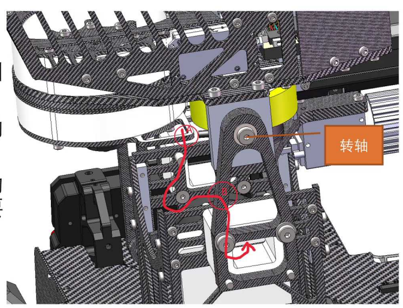

#  机器人走线总结（以双C板为例）
贡献者：蒋英俊
## 走线的目的
- 实现基础功能
- 安全
- 美观
## 认识线材
**除非没办法，不准用杜邦线**
| 线号 | 股数/线径（条/mm） | 铜丝直径（mm） | 外皮外径（mm） | 绝缘厚度（mm） | 导体电阻（欧姆/千米） | 截面积（平方毫米） | 允载电流（安培） | 米/卷 |
| ---- | ------------------ | -------------- | -------------- | -------------- | --------------------- | -------------------- | ------------------ | ------- |
| 6AWG | 3200/0.08mm        | 5.2            | 8.5            | 1.65           | 1.21                  | 16.08              | 300                | 100   |
| 8AWG | 1650/0.08mm        | 4.40           | 6.30           | 1.2            | 4.1                   | 8.29               | 190                | 100   |
| 10AWG| 1050/0.08mm        | 2.92           | 5.5            | 5.28           | 6.3                   | 5.3                | 140                | 100   |
| 12AWG| 680/0.08mm         | 2.41           | 4.5            | 3.42           | 9.8                   | 3.4                | 88.4               | 100   |
| 14AWG| 400/0.08mm         | 1.85           | 3.5            | 2              | 15.6                  | 2.07               | 55.6               | 200   |
| 16AWG| 252/0.08mm         | 1.47           | 3.00           | 1.30           | 24.4                  | 1.27               | 35                 | 200   |
| 18AWG| 150/0.08mm         | 1.13           | 2.3            | 0.75           | 39.5                  | 0.75               | 22                 | 200   |
| 20AWG| 100/0.08mm         | 0.92           | 1.80           | 0.5            | 62.5                  | 0.5                | 13.87              | 200   |
| 22AWG| 60/0.08mm          | 0.72           | 1.7            | 0.3            | 88.6                  | 0.33               | 8.73               | 200   |
| 24AWG| 40/0.08mm          | 0.58           | 1.6            | 0.2            | 97.6                  | 0.2                | 5                  | 200   |
| 26AWG| 30/0.08mm          | 0.44           | 1.5            | 0.15           | 123                   | 0.14               | 3.5                | 200   |
| 28AWG| 16/0.08mm          | 0.32           | 1.2            | 0.08           | 227.2                 | 0.08               | 1.25               | 200   |
| 30AWG| 11/0.08mm          | 0.3            | 0.8            | 0.055          | 331                   | 0.06               | 0.8                | 200   |

| 电机/电调     | C610（2006） | C620（3508） | 6020 | 4310 |
| ------------- | -------------- | -------------- | ------ | ------ |
| 峰值电流/最大持续电流（A） | 10           | 20             | 1.62   | 7.5    |
| 推荐规格（AWG）       | 18           | 16、18         | 18     | 18     |

| 其他模块 | 开发板 | 小电脑 |
| -------- | ------ | -------- |
| 推荐规格（AWG） | 18     | 16       |

- **认识连接器**
  - XT30
    - 公头输入，母头输出
  - XT60
    - 公头输入，母头输出
  - GH
    - CAN接线，串口接线
## 绝缘
- **热缩管**
  - 焊线前先套热缩管
  - 热风枪吹的时候用镊子往外推热缩管
  - 吹完一定要检查是否吹牢
   - 

## CAN简介
- **总线类型**：差分信号总线（CANH和CANL两根线组成）
  - 显性电平（1）：CANH电压比CANL高至少1V
  - 隐性电平（0）：CANH与CANL电压基本相等
- **特性**：
  - 串行通信（高频率，逐位传输）
  - 半双工（双向传输，但不可同时收发）
  - 需仲裁机制（设备发送时需竞争总线控制权）

## 经典 CAN协议
- **工作频率**：1MHz
- **数据包规范**：
  - 长度：108位
  - 发送频率：≤1kHz
  - 包含目标ID号（8字节数据 + 校验信息）
- **应用场景**：
  - 电调接线、裁判系统M8航空线、电容管理接线等
- **传输时间**：单个数据包需108~123μs

## CAN设备数量上限
- **理论极限**：1ms内最多传输8.13个数据包
- **设备限制**：一般允许8个设备
- **突破限制方法**：
  - 降低电调反馈频率（如刷固件调整为500Hz）
  - 不建议常规使用

## 终端电阻
- **要求**：CAN总线两端需安装两个120Ω电阻（手挽手式连接）
- **配置说明**：
  - 主控板已集成终端电阻
  - 仅距离主控板最远的设备需开启电阻开关
  - 达妙没开关的电机集成了120Ω终端电阻
  - 

## 控制与视觉模块
- **主控板通信**：
  - 与小电脑通过4pin串口通信
- **CAN分配**：
  - CAN2：云台，发射机构（无需过滑环）
  - CAN1：板件通信（需过滑环）
- **电源分配**：主控板负责Mini-PC电源分配
- **其他接口**：红点激光通过5V接口取电

## 云台裁判系统
- **接线规范**：
  - 测速、图传和定位模块可串联（使用Y型连接器）
  - 滑环需过一根航空线
- **供电**：17mm充能模块从Ammo-Booster取电

## 底盘裁判系统与电容

- **主控板通信**
  * 与电源管理通过3Pin串口通信
  * 
  * 
- **CAN分配**
  - 计算总线负载进行合理分配
- **装甲板接线**：必须接成环路
  - 
- **Gimbal接口**：分电板分配电源（有一个要过滑环给Pitch）
- **Ammo-Booster**：分电板分配电源（有一个要过滑环给摩擦轮）
## 线材固定与保护
- **扎带**：
  - 宽度1-3mm，黑色为主（信号线用小扎带，电源线用大扎带）
  - 剪切需用斜口钳，多出来的不准留着
- **蛇皮网/缠绕管**：
  - 包裹多股线材，增强耐磨性
  - 常用直径2~10mm，两端用扎带固定
- **硅橡胶**：
  - 保护接头，固定牢固（平时就用，用完把**尖嘴取下，拧上盖子**，用的时候用餐巾纸裹起来）
  - 硅橡胶固化需要时间（半小时左右），在周围做好遮盖（防止电机转子、摩擦轮上有硅橡胶残留）
  - 

## 走线规范
- **基本原则**：
  - 线材不得外露，避免往复运动
  - 所有线材尽量远离会相对线材运动的结构
  - 线材不能与机械结构干涉（如避震、云台等）
  - 线材远离发热物体（比如紫光灯片）
  - 确保线材固定牢固
  - 信号线需屏蔽或远离干扰源（电源线，电机，电磁阀等，和CAN并行的驱动线，具备2A/秒的电流变化，就会耦合出强磁场而导致CAN线上出现干扰脉冲），如果不得不和干扰源走一起，将信号线进行**双绞**（干扰信号X对CAN-H和CAN-L双绞线导线的干扰是等幅值、等相位、等频率）
  - 非屏蔽线（<22AWG）需用蛇皮网或者缠绕管保护
  - 屏蔽线的屏蔽层必须**接地**否则不起屏蔽作用
  - 不同用途的线材需用不同颜色的标签纸区分
  
  
- **旋转结构走线**：
  
  - **空心轴**：线材穿过空心轴（最大支持720°转动）
    - 用于不会发生360度连续转动的结构
    - 机械上使用空心轴作为转轴
        - GM6020空心轴
        - 法兰铝空心轴加工件
    - 经过旋转结构的线材从空心轴中穿过
    - 常用于:不需要小陀螺的Yaw,Pitch轴等
    
  
  - **侧面固定**：转动<180°时，线束固定于转轴附近
    - 用于发生转动小于180度时
    - 如果旋转结构的转轴直径较小,且侧面或转轴轴线上有固定空间,则可以使用侧面固定
    - 将所有经过旋转结构的线材固定为一束
    - 将线材在转轴附近的两个点固定,确保线材经过转轴
    - 常用于:底盘悬挂
     
  
  - **轴侧双端固定**：预留冗余长度，避免结构干涉
    - 用于发生转动小于180度时
    - 将所有经过旋转结构的线材固定为一束,用缠绕管保护
    - 将线材在转轴发生相对运动的结构上靠近转轴双端固定
    - 由于线材偏离轴线,结构运动时走线长度会变化,线材需要预留一定的冗余长度
    - 常用于:Pitch轴
    
  
- **复杂结构**：万不得已时使用弹簧线（需内置保护）

## CAN走线规范
- **总线式布局**：
  - 主控板与中心板间线材可长
  - 中心板与电调线材需短（<50cm） 
- **屏蔽线使用场景**：
  - 走线>50cm、滑环出线、多CAN混合时
  - 单个远距离电调需使用屏蔽线

## 注意事项
1. **接地**：车体导电部件默认接地（电池负极），避免电源正极短路

2. **干扰处理**：
   - 场地交互模块需独立走线并屏蔽
   - 电机电源线远离信号线
   
3. **禁止操作**：

   - 热熔胶对的电调、电机、核心板等设备的接口进行固定
   - 用热熔胶/泡沫胶带做固定
   - 直接把线材直接粘在铝管和碳板上（危险）
   - 裸露电池开关
   - 空中对接接头（优先用长导线）
